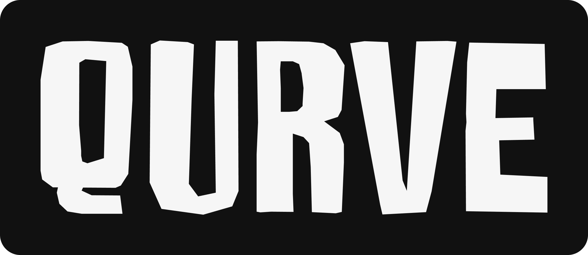

<p align="center">
  
</p>

<div align="center">

# Qurve

**High-performance React charting built on Canvas**

[Visx](https://airbnb.io/visx)-like composability meets the raw power of HTML5 Canvas.

</div>

## Why Qurve?

Most React charting libraries render to SVG—and it shows. As your datasets grow, so does the DOM. Qurve takes a different approach:

- **Canvas rendering** — Thousands of data points? No problem. Canvas blazes through them.
- **Visx-style primitives** — Compose charts from low-level building blocks. Customize everything.
- **Zero runtime overhead** — No heavyweight charting engines. Just React + Canvas.
- **TypeScript-first** — Full type safety out of the box.

## Quick Start

```bash
npm install qurve
```

```tsx
import { CanvasChart, LineSeries, LinearAxis } from 'qurve';

function App() {
  const data = [
    { x: 0, y: 0 },
    { x: 1, y: 2 },
    { x: 2, y: 4 },
    { x: 3, y: 8 },
  ];

  return (
    <CanvasChart width={600} height={400} data={data}>
      <LinearAxis orientation="bottom" />
      <LinearAxis orientation="left" />
      <LineSeries x="x" y="y" strokeWidth={2} />
    </CanvasChart>
  );
}
```

## Features

| Feature | Status |
|---------|--------|
| Line Chart | ✅ |
| Bar Chart | 🚧 |
| Area Chart | 🚧 |
| Scatter Plot | 🚧 |
| Pie/Donut | 🚧 |
| Axes (Linear, Band, Time) | 🚧 |
| Tooltips & Legends | 🚧 |
| Brush, Pan & Zoom | 🚧 |

## Philosophy

Qurve isn't a drop-in replacement for Recharts or Chart.js. It's for developers who want:

1. **Full control** — Need a custom axis? Build it from primitives.
2. **Performance** — SVG choking on 50K+ points? Canvas laughs.
3. **Bundle size sanity** — Import only what you need.

## License

MIT
