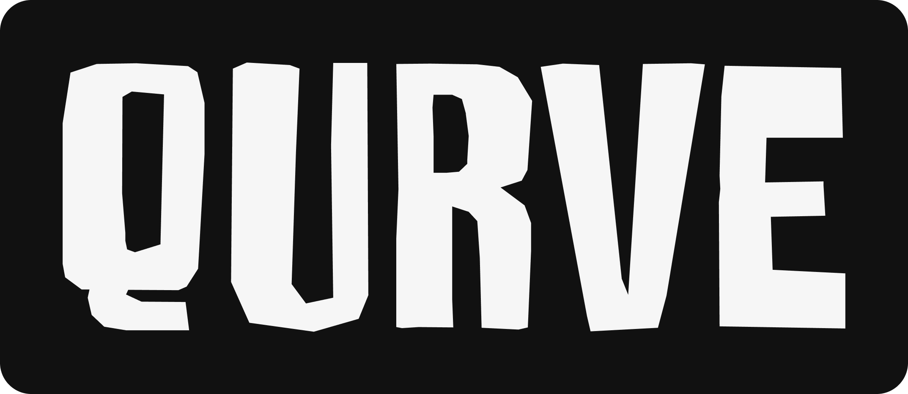

<p align="center">
  
</p>

<div align="center">

# Qurve

**High-performance React charting built on Canvas**

[Visx](https://airbnb.io/visx)-like composability meets the raw power of HTML5 Canvas.

[](https://www.npmjs.com/package/qurve)
[](https://github.com/timurmaio/qurve/actions/workflows/ci.yml)
[](./packages/qurve/coverage)
[](#project-status)

</div>

> **⚠️ Project Status: Not ready for use**  
> This is an experimental proof of concept. The API is unstable and may change without notice. Do not use in production. See [Project Status](#project-status) for details.

## Project Status

| Aspect | Status |
|--------|--------|
| **Stability** | Proof of concept — not production-ready |
| **API** | Unstable; breaking changes expected |
| **Recommendation** | For experimentation and feedback only |

This repository exists to validate the approach and gather feedback. If you're looking for a stable, battle-tested charting solution, consider [Recharts](https://recharts.org/), [Visx](https://airbnb.io/visx), or [Chart.js](https://www.chartjs.org/) instead.

## Why Qurve?

Most React charting libraries render to SVG—and it shows. As your datasets grow, so does the DOM. Qurve takes a different approach:

- **Canvas rendering** — Thousands of data points? No problem. Canvas blazes through them.
- **Visx-style primitives** — Compose charts from low-level building blocks. Customize everything.
- **Zero runtime overhead** — No heavyweight charting engines. Just React + Canvas.
- **TypeScript-first** — Full type safety out of the box.

## Quick Start

*For experimentation only. See [Project Status](#project-status) before using.*

```bash
npm install qurve
```

```tsx
import { Chart, Line, XAxis, YAxis, CartesianGrid, Tooltip, Legend, Brush } from 'qurve';

function App() {
  const data = [
    { x: 0, y: 0 },
    { x: 1, y: 2 },
    { x: 2, y: 4 },
    { x: 3, y: 8 },
  ];

  return (
    <Chart width={700} height={360} data={data} margin={{ bottom: 28 }}>
      <CartesianGrid strokeDasharray="3 3" />
      <XAxis dataKey="x" />
      <YAxis />
      <Line dataKey="y" type="monotone" strokeWidth={2} />
      <Legend selectionMode="single" />
      <Tooltip sticky />
      <Brush />
    </Chart>
  );
}
```

## Features

| Feature | Status |
|---------|--------|
| Line Chart | ✅ |
| Bar Chart | ✅ |
| Area Chart | ✅ |
| Scatter Plot | ✅ |
| Pie/Donut | ✅ |
| Axes (Linear, Band, Time) | ✅ |
| Tooltips & Legends | ✅ |
| Brush, Pan & Zoom | ✅ |

## Docs

- Package docs: `packages/qurve/README.md`
- Migration guide: `packages/qurve/MIGRATION.md`
- Interactive comparison page (Qurve vs Recharts): run `pnpm dev` and open `/comparison`

## Philosophy

Qurve isn't a drop-in replacement for Recharts or Chart.js—and in its current proof-of-concept state, it's not intended to be. The goal is to validate an approach: React charting that offers:

1. **Full control** — Need a custom axis? Build it from primitives.
2. **Performance** — SVG choking on 50K+ points? Canvas laughs.
3. **Bundle size sanity** — Import only what you need.

## License

MIT
